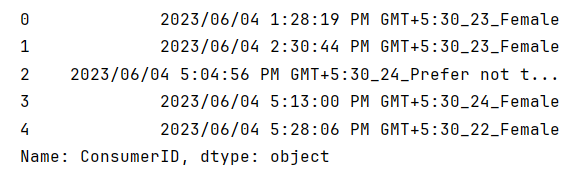

# Amazon Consumers Behavior Analysis
The goal of this project are as following:
- To enhance my data analysis skills, including analytical thinking, storytelling skill, and the ability to design effective and visually appealing dashboards.
- To deepen my understanding of data visualization tools. By mastering these tools, I aim to efficiently handle the full data analysis workflow from data cleaning and exploration to visualization and reporting, which allows me to spend more time on in-depth business insights and strategic analysis.

## Tools Used
- Python, pandas
- Jupyter Notebook
- Tableau

## Navigation
[Amazon Consumers Behavior Analysis](#amazon-consumers-behavior-analysis)
- [1. Background](#1-background)
- [2. Introduction of the Dataset](#2-introduction-of-the-dataset)
- [3. Data Cleaning and Preprocessing](#3-data-cleaning-and-preprocessing)
    - [3.1 Data Import](#31-data-import)
    - [3.2 Dataset Summary and Structure](#32-dataset-summary-and-structure)
    - [3.3 Remove Duplicates](#33-remove-duplicates)
    - [3.4 Handle Missing Values](#34-handle-missing-values)
    - [3.5 Data Standardization](#35-data-standardization)
    - [3.6 Generate New Dataset](#36-generate-new-dataset)
- [4. Consumer Profile and Behavioral Characteristics](#4-consumer-profile-and-behavioral-characteristics)
    - [4.1 Consumer Profile](#41-consumer-profile)
    - [4.2 Consumer Behavior Patterns](#42-consumer-behavior-patterns)
- [5. Consumer Shopping Journey](#5-consumer-shopping-journey)
    - [5.1 Pre-Purchase](#51--pre-purchase)
    - [5.2 During Purchase](#52-during-purchase)
    - [5.3 Post-Purchase](#53-post-purchase)
- [6. Platform Service Impact Factors and Improvement Recommendations](#6-platform-service-impact-factors-and-improvement-recommendations)
    - [6.1 Analysis of Amazon's Strengths](#61-analysis-of-amazons-strengths)
    - [6.2 Recommendations for Improvement on Amazon](#62-recommendations-for-improvement-on-amazon)
    - [6.3 Personalized Recommendation Analysis](#63-personalized-recommendation-analysis)
    - [6.4 Shopping Experience Satisfaction Analysis](#64-shopping-experience-satisfaction-analysis)
- [7. Conclusion and Recommendations](#7-conclusion-and-recommendations)

## 1. Background
In recent years, the cross-border e-commerce market has grown rapidly, with competition between major platforms becoming increasingly intense. Rising challengers like Shein and Temu have been expanding aggressively. Although their user bases haven’t yet surpassed Amazon’s, their rapid growth is impossible to ignore. In this highly competitive landscape, Amazon must continue to improve its services and products to enhance the user experience and maintain its leading position in the global market.

This project uses online consumer survey data to analyze Amazon’s consumer base and behavior, providing insights into its position as a key player in the cross-border e-commerce market. It takes a deep dive into customer demographics, shopping preferences, and purchase behavior throughout the buying journey. It also explores how consumers perceive Amazon’s strengths, weaknesses, and unique service features.

The goal is to offer actionable insights that can help both Amazon and its third-party sellers better understand and respond to consumer needs, creating a win-win situation for the platform, the sellers, and the customers.

## 2. Introduction of the Dataset
The data source used for this project is https://www.kaggle.com/datasets/swathiunnikrishnan/amazon-consumer-behaviour-dataset. This dataset is collected to analyze the behavior of Amazon’s consumers. It consists of a comprehensive collection of customer interactions and browsing patterns within the Amazon ecosystem. 

Features:
- **age** = age
- **gender** = gender
- **Purchase_Frequency** = How frequently do you make purchases on Amazon?
- **Purchase_Categories** = What product categories do you typically purchase on Amazon?
- **Personalized_Recommendation_Frequency** = Have you ever made a purchase based on personalized product recommendations from Amazon?
- **Browsing_Frequency** =How often do you browse Amazon’s website or app?
- **Product_Search_Method** =How do you search for products on Amazon?
- **Search_Result_Exploration** =Do you tend to explore multiple pages of search results or focus on the first page?
- **Customer_Reviews_Importance** =How important are customer reviews in your decision-making process?
- **Add_to_Cart_Browsing** =Do you add products to your cart while browsing on Amazon?
- **Cart_Completion_Frequency** =How often do you complete the purchase after adding products to your cart?
- **Cart_Abandonment_Factors** =What factors influence your decision to abandon a purchase in your cart?
- **Saveforlater_Frequency** =Do you use Amazon’s “Save for Later” feature, and if so, how often?
- **Review_Left** =Have you ever left a product review on Amazon?
- **Review_Reliability** =How much do you rely on product reviews when making a purchase?
- **Review_Helpfulness** =Do you find helpful information from other customers’ reviews?
- **Personalized_Recommendation_Frequency** =How often do you receive personalized product recommendations from Amazon?
- **Recommendation_Helpfulness** =Do you find the recommendations helpful?
- **Rating_Accuracy** =How would you rate the relevance and accuracy of the recommendations you receive
- **Shopping_Satisfaction** =How satisfied are you with your overall shopping experience on Amazon?
- **Service_Appreciation** =What aspects of Amazon’s services do you appreciate the most?
- **Improvement_Areas** =Are there any areas where you think Amazon can improve? 

## 3. Data Cleaning and Preprocessing
### 3.1 Data Import
I import essential libraries and load the Amazon customer survey dataset into a DataFrame, setting the stage for data exploration and analysis.

```python
# Importing necessary libraries and suppressing warnings
import warnings

warnings.filterwarnings('ignore')

import numpy as np
import pandas as pd

df = pd.read_csv("Amazon Customer Behavior Survey.csv")

df.head()
```


### 3.2 Dataset Summary and Structure
I check the dataset’s structure and summary statistics to understand the column types, data completeness, and key numerical patterns such as central tendency, spread, and potential outliers.

```python
df.info()
```


```python
df.describe()
```


There are no outliers in the dataset.

### 3.3 Remove Duplicates
I check the dataset for any duplicate records and remove them if found.

```python
# Checking for duplicates
df.duplicated().sum()
```


There are no outliers in the dataset.

### 3.4 Handle Missing Values
I check for missing values in the dataset and find that only two values are missing in the column ‘**Product_Search_Method**’. I decide to fill them with **‘None’**.

```python
df.isnull().sum()
```


```python
df['Product_Search_Method'] = df['Product_Search_Method'].fillna('None')
df.isnull().sum()
```


### 3.5 Data Standardization
I create a new column named ‘**ConsumerID**’ by combining columns ‘**Timestamp**’, ‘**age**’ and ‘**Gender**’ to support table joins in Tableau. 

```python
df['ConsumerID'] = df['Timestamp'].astype(str) + "_" + df['age'].astype(str) + "_" + df['Gender'].astype(str)
df['ConsumerID'].head()
```


For column ‘**Rating_Accuracy**’ which means how would you rate the relevance and accuracy of the recommendations you receive, contains values from 1 to 5. To make the data more intuitive, I decide to categorize the responses based on their content into five levels: **Very Inaccurate, Inaccurate, Neutral, Accurate, and Very Accurate**.
```python
rating_map = {
    1: 'Very Inaccurate',
    2: 'Inaccurate',
    3: 'Neutral',
    4: 'Accurate',
    5: 'Very Accurate'
}

df['Rating_Accuracy_Text '] = df['Rating_Accuracy '].map(rating_map)
```

The same categorization process needs to be applied to column ‘**Personalized_Recommendation_Frequency**’, ‘**Shopping_Satisfaction**’, and ‘**age**’ as well.

```python
freq_map = {
    1: 'Never',
    2: 'Rarely',
    3: 'Occasionally',
    4: 'Often',
    5: 'Always'
}

df['Personalized_Recommendation_Frequency _Text'] = df['Personalized_Recommendation_Frequency '].map(freq_map)
```
```python
satisfy_map = {
    1: 'Very Dissatisfied',
    2: 'Dissatisfied',
    3: 'Natural',
    4: 'Satisfied',
    5: 'Very Satisfied'
}

df['Shopping_Satisfaction_Text'] = df['Shopping_Satisfaction'].map(satisfy_map)
```
```python
bins = [0, 20, 25, 30, 35, 40, 45, 50, float('inf')]
labels = ['Under 20', '21-25', '26-30', '31-35', '36-40', '41-45', '46-50', 'Over 50']

df['age_Distribution'] = pd.cut(df['age'], bins=bins, labels=labels, right=True)
```

Great! Now that the data has been cleaned, let’s go ahead and export the cleaned dataset.
```python
df.to_csv("amazon_survey_cleaned.csv", index=False, encoding='utf-8')
```

### 3.6 Generate New Dataset
Since I need to analyze consumer preferences in product purchases, I’ll generate a new dataset for that purpose.

The '**Purchase_Categories**' column contains multiple values separated by ";", so I first split it into five separate columns. 
```python
df_split = df['Purchase_Categories'].str.split(';', expand=True)
df_split.columns = [f'Category_Preference{i + 1}' for i in range(df_split.shape[1])]
df_split.columns
```


After that, I combined these columns back into a single column to restore the original structure in a cleaner format.
```python
# To support further analysis, I keep column ‘Timestamp', 'age', 'Gender', 'age_Distribution', 'Purchase_Frequency', and 'Category_Preference', and filter out any records with missing category preference information.
df_melt = pd.melt(
    pd.concat([df[['ConsumerID', 'Gender', 'age_Distribution', 'Purchase_Frequency']], df_split], axis=1),
    id_vars=['ConsumerID', 'Gender', 'age_Distribution', 'Purchase_Frequency'],
    value_vars=df_split.columns,
    value_name='Category_Preference'
).dropna(subset='Category_Preference')
```
With that done, I’m now ready to export the updated dataset.
```python
df_melt.to_csv("Consumer_Preference.csv", index=False, encoding='utf-8')
```

In addition, I need to analyze consumer shopping behavior as well, so I’ll need to perform a similar operation as well.

First, since there are no duplicate records, each entry represents a unique consumer.
```python
# Each row represents a single consumer
df['Consumer_Count'] = 1
```
Then, I convert ‘**Add_to_Cart_Browsing**’, ‘**Cart_Completion_Frequency**’, and ‘**Consumer_Count**’ these three columns into rows, and then filter the dataset.

```python
df_melted = pd.melt(
    df,
    id_vars=['ConsumerID'],
    value_vars=[
        'Add_to_Cart_Browsing',
        'Cart_Completion_Frequency',
        'Consumer_Count'
    ],
    var_name='Column_Name',
    value_name='Values'
)

# Filter the dataset
df_filtered = df_melted[
    (df_melted['Column_Name'] == 'Consumer_Count') |
    ((df_melted['Column_Name'] == 'Add_to_Cart_Browsing') & (df_melted['Values'] == 'Yes')) |
    ((df_melted['Column_Name'] == 'Cart_Completion_Frequency') & (df_melted['Values'] == 'Always'))
    ]
```
Finally, I export the dataset.
```python
df_filtered.to_csv("Shopping_Behavior.csv", index=False, encoding='utf-8')
```

## 4. Consumer Profile and Behavioral Characteristics
### 4.1 Consumer Profile


*Insights*:
- Amazon’s customer base is predominantly female, making up **58.47%** of the total.
- The majority of users fall within the **21–35** age range, accounting for **68.77%**, with the **21–25** segment alone representing **40.86%**. This highlights a **relatively young customer demographic** on the platform.
- Through a combined analysis of gender and age, we can see that the age distribution for **female** consumers is mainly concentrated in the **21–25 and 31–35** age groups, while **male** consumers are primarily in the **21–25 and 26–30** ranges. For **both genders**, the **21–25** group has the highest proportion.

### 4.2 Consumer Behavior Patterns


*Insights*:
- Consumers’ top three preferred categories are **Clothing & Fashion, Beauty & Personal Care, and Home & Kitchen**.
- A large portion of consumers shop **few times a month**, making up **one-third** of the total user.

A **multi-level cross-analysis** of **gender**, **age**, **product preferences**, and **shopping frequency** reveals the following:


- **Female**, **21-25** years old, shops **few times a month**: tends to favor **beauty & personal care**.


- **Female**, **31-35** years old, shops **few times a month**: tends to favor **clothing & fashion**.


- **Male**, **21-25** years old, shops **few times a month**: also prefer **clothing & fashion**.


- **Male**, **26-30** years old, shops **few times a month**: prefer **groceries & gourmet food and others**.

## 5. Consumer Shopping Journey
### 5.1  Pre-Purchase


*Insights*:
- Base on consumer search habits, most users tend to search using **product categories and keywords**, accounting for **37.04%** and **35.55%** respectively.
- **Recommendation**: Amazon sellers should **optimize their strategies around product categories and relevant keywords**.

### 5.2 During Purchase


*Insights*:
- Consumers show a **high reliance on other's product reviews** when making purchase decisions, with **57.81%** indicating they value reviews highly. Most consumers consider reviews to be **informative and helpful**, especially when deciding whether a product is worth buying.
- **Recommendation**: **Amazon** should **focus on improving the quality and usefulness of reviews**, and **sellers** should **strengthen pre-sale communication and customer services**.


*Insights*:
- **35.88%** of consumers add products to their cart but do not complete the purchase, and **21.77%** eventually buy it. This indicates that **most consumers tend to purchase after adding items to the cart**.


*Insights*:
- Main reasons for cart abandonment include: **finding a better price elsewhere, no longer needing the item, or high shipping costs**.
- **Recommendation**: **By optimizing supply chain operations to reducing logistics and warehousing storage costs**, Amazon and sellers can **offer better prices and achieve win-win outcomes**.

### 5.3 Post-Purchase


*Insights*:
- **Nearly half** of consumers **do not leave a review after purchase**. However, leaving reviews after purchase **plays an important role** in influencing future purchase decisions.
- **Recommendation**: Amazon and sellers should **pay more attention to reviews, provide high-quality products and services, and actively seek positive feedback to boost product sales**.

## 6. Platform Service Impact Factors and Improvement Recommendations
### 6.1 Analysis of Amazon's Strengths


*Insights*:
- Amazon's most appreciated features among consumers are its **product recommendations and competitive prices**, with respective rates of **30.73%** and **30.23%**.
- **Recommendation**: Amazon and sellers **continue improving personalized product delivery and recommendation services**.

### 6.2 Recommendations for Improvement on Amazon


*Insights*:
- Among consumers' suggestions for improving Amazon, the top 3 are: **customer service and responsiveness, product quality and accuracy, and reducing packaging waste**.
- **Recommendation**: **Amazon** could **enhance customer service training to improve responsiveness**. **Sellers** are encouraged to **focus more on product quality to meet consumer expectations, and improve information accuracy and packaging reliability to avoid mismatches and reduce waste**.

### 6.3 Personalized Recommendation Analysis


*Insights*:
- Consumers are generally satisfied with Amazon's product recommendations. However, analysis shows that **recommendation frequency is low and product matching is sometimes inaccurate**, with **only 12.79%** of consumers finding the recommendations **accurate**.
- **Recommendation**: Amazon **optimizes its product recommendation services by improving the accuracy of user-product matching and increasing the frequency of recommendations to attract more consumers**. Sellers can **gain deeper insights into Amazon's recommendation algorithms to maximize product exposure**.

### 6.4 Shopping Experience Satisfaction Analysis


*Insights*:
- As shown in the pie chart above, **consumers' satisfaction with Amazon is quite low**, with **over 50%** of users expressing **dissatisfaction**.
- **Recommendation**: Amazon and sellers should **work together to improve logistics performance, pre-sale and post-sale services, and personalized support to boost overall consumer satisfaction**.

## 7. Conclusion and Recommendations
**Consumer Profile & Preferences**:
- **Amazon's user base skews younger**, with a strong concentration in the 21–25 age group. Additionally, **product preferences vary between genders**. Sellers are advised to **focus on categories that appeal to younger consumers and invest in developing popular, trending products**.

**Pre-Purchase Behavior**:
- Consumers primarily search for products using **keywords such as product names, brands, or intended uses, as well as by browsing through categories**. These searches often include long-tail or highly specific keywords and may involve suggestions from the drop-down menu.
- **Recommendation**: Sellers should take advantage of this behavior by **incorporating relevant keywords from the drop-down suggestions into their product listings or ad campaigns to boost visibility**.

**Behavior during shopping**:
- During the purchase stage, **other users’ product reviews greatly influence consumer decisions. Maintaining a strong base of positive reviews** is crucial.
- **The conversion rate from browsing to adding items to the cart is quite high**. Therefore, while it’s important to attract consumers to browse, the platform should also **focus on guiding users to add products to their cart**.
- **Once a product is added to the cart, the customer’s purchase intent is generally strong**. This means sellers should **prioritize boosting product exposure and engaging with customers**.

**Post-Purchase Behavior**: 
- Analysis shows that **nearly half of customers don’t leave reviews**.
- **Recommendation**: Both sellers and the platform should **pay close attention to customer reviews**. By **offering high-quality products and services**, they can actively earn positive feedback, which in turn helps boost product sales.

**Amazon’s Strengths & Weaknesses**:
- Strengths:
    - **Competitive pricing**
    - **Personalized product recommendations**
- Weaknesses:
    - **Slow customer service response**
    - **Inconsistent product quality and accuracy**
    - **Excessive packaging waste**
- **Recommendation**: Amazon should **focus on improving customer support, collaborating with sellers** to **offer better quality products at reasonable prices, and promoting environmentally friendly packaging solutions**.

**Personalized Recommendation Feature**: 
- The personalized product recommendation system positively encourages consumers to make purchases, but users report **low accuracy and frequency**.
- **Recommendation**: Amazon should **improve product-user matching algorithms and increase the frequency of relevant suggestions to boost engagement**.

**Shopping Experience & Satisfaction Factors**:
- Survey feedback shows that many users rate their experience as only "**neutral**" or "**unsatisfied**." Key pain points:
    - Product pricing
    - Product quality
    - Shipping fees and speed
    - Return policies
- **Recommendation**: Amazon should focus on **improving these areas** to **enhance the overall shopping experience and increase user satisfaction**.
